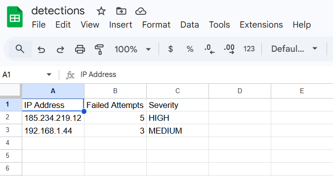
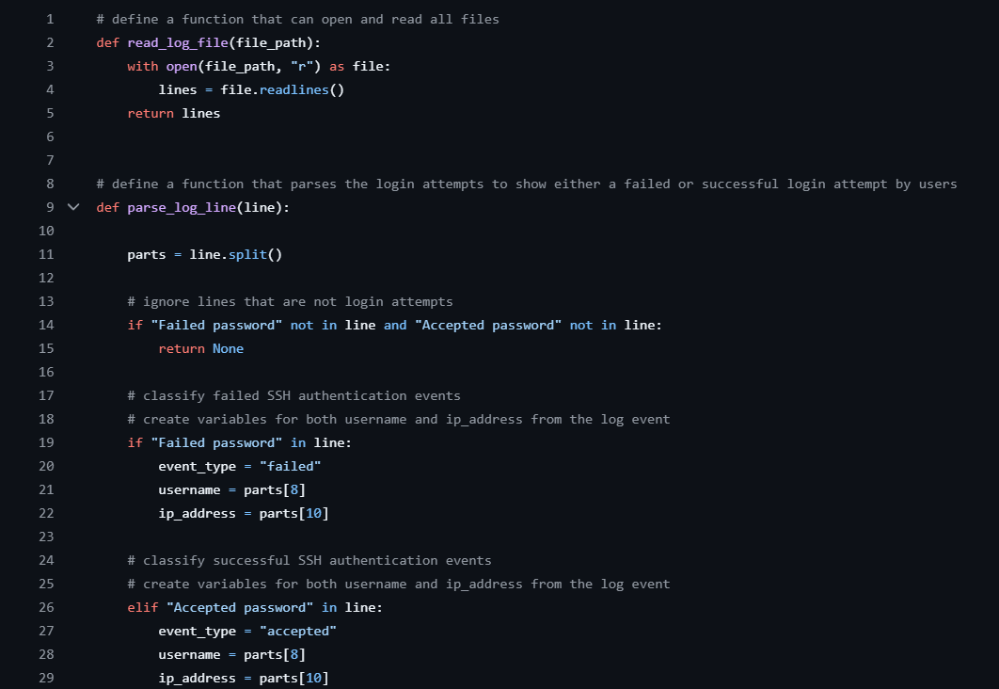
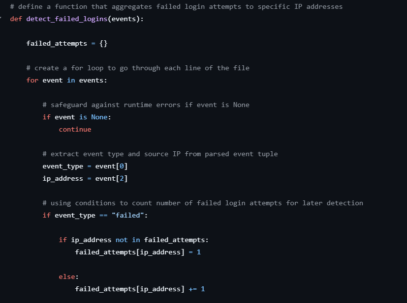
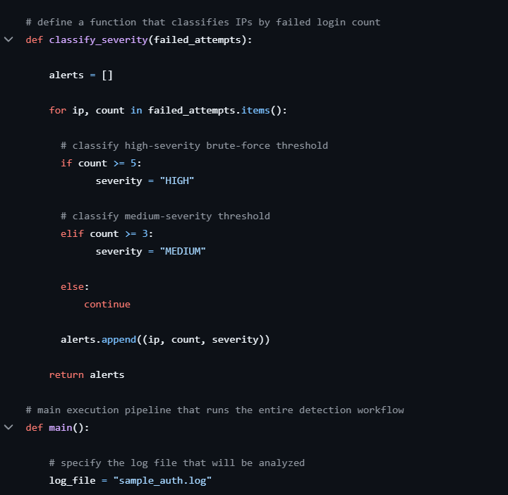

# Module 1 — Python Log Detection

This module demonstrates a Python-based detection workflow that parses Linux SSH authentication logs and identifies suspicious login activity such as brute-force attempts.

The script reads authentication logs, aggregates failed login attempts by IP address, and classifies suspicious activity using simple detection thresholds.

---

# Objective

Build a simple SOC-style detection script that:

* Parses Linux `auth.log` authentication events
* Identifies failed SSH login attempts
* Aggregates failed attempts by IP address
* Applies detection thresholds
* Exports results to a CSV report

---

# Detection Logic

The detection logic applies the following thresholds:

| Failed Attempts | Severity |
| --------------- | -------- |
| 3–4 attempts    | MEDIUM   |
| 5+ attempts     | HIGH     |

This simulates a basic brute-force detection rule similar to what might exist in a SIEM detection pipeline.

---

# Detection Pipeline

The script runs the following workflow:

1. **read_log_file()**
   Reads the authentication log file line-by-line.

2. **parse_log_line()**
   Extracts event type, username, and source IP address from SSH log entries.

3. **detect_failed_logins()**
   Aggregates failed login attempts by source IP address.

4. **classify_severity()**
   Applies detection thresholds and assigns alert severity.

5. **main()**
   Executes the detection pipeline and outputs the results.

---

# Script Execution

The script is executed from the terminal using:

```
python main.py
```

Example execution:


---

# Detection Output

Detected suspicious login activity is exported to CSV and can be viewed in spreadsheet tools.

Example output:



Example records:

| IP Address     | Failed Attempts | Severity |
| -------------- | --------------- | -------- |
| 185.234.219.12 | 5               | HIGH     |
| 192.168.1.44   | 3               | MEDIUM   |

---

# Code Examples

### Log Parsing Logic



### Failed Login Aggregation



### Alert Classification



---

# Assumptions

This parser assumes **one authentication event per line**, consistent with standard Linux `auth.log` SSH entries.

---

# Limitations

* The parser assumes a consistent SSH log structure
* Log parsing relies on fixed field positions within the log line
* The script performs offline log analysis rather than real-time monitoring

---

# Output

The script produces:

* Terminal detection alerts
* A CSV file: `output/detections.csv`

Example terminal alerts:

```
('185.234.219.12', 5, 'HIGH')
('192.168.1.44', 3, 'MEDIUM')
``` 
