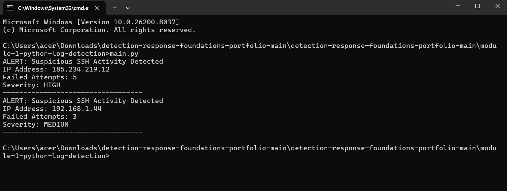

## Module 1 — Python Log Detection

This module demonstrates a Python-based detection workflow that parses Linux SSH authentication logs and identifies suspicious login activity such as brute-force attempts.

The script reads authentication logs, aggregates failed login attempts by IP address, and classifies suspicious activity using simple detection thresholds.

---

## Objective

Build a simple SOC-style detection tool that:

* Parses Linux `auth.log` authentication events
* Identifies failed SSH login attempts
* Aggregates failed attempts by IP address
* Applies detection thresholds
* Exports results to a CSV report

---

## Detection Logic

The detection logic applies the following thresholds:

| Failed Attempts | Severity |
| --------------- | -------- |
| 3–4 attempts    | MEDIUM   |
| 5+ attempts     | HIGH     |

This simulates a simplified brute-force detection rule similar to those implemented in SIEM or log analysis pipelines.

---

## Detection Pipeline

The script executes the following workflow:

1. **read_log_file()**
   Reads the authentication log file line-by-line.

2. **parse_log_line()**
   Extracts event type, username, and source IP address from SSH authentication events.

3. **detect_failed_logins()**
   Aggregates failed login attempts by source IP address.

4. **classify_severity()**
   Applies detection thresholds and assigns alert severity.

5. **main()**
   Executes the detection workflow and outputs the results.

---

## Script Execution

The script is executed from the terminal using:

```
python main.py
```

Example execution:



---

## Using the Larger Log Dataset (Optional)

The repository also includes a larger test dataset:

`sample_auth_large.log`

This file contains a la
