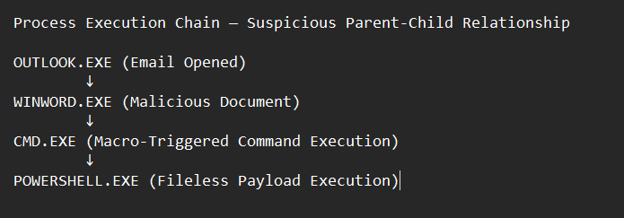
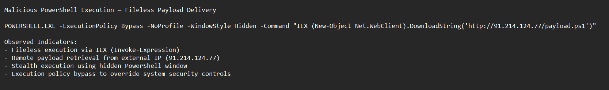
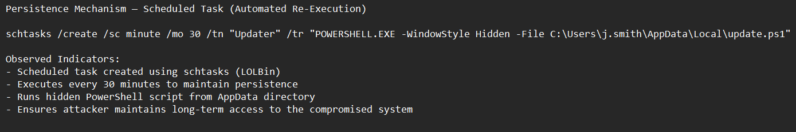

# Module 5 — Incident Documentation

## Overview

This module demonstrates the ability to translate technical investigation findings into a structured, professional incident report suitable for SOC and DFIR environments.

The focus is on clearly communicating attacker behavior, impact, and response actions based on endpoint telemetry and correlated events.

---

## Executive Summary

On **09/04/2026**, a security incident was identified involving a compromised user endpoint following interaction with a malicious email attachment.

The attack began when a user opened a phishing email in Microsoft Outlook and executed a malicious document. This triggered a sequence of abnormal process activity including:

**WINWORD.EXE → cmd.exe → powershell.exe**

This behavior is consistent with adversary execution techniques using legitimate system tools.

Further analysis confirmed the use of **IEX (Invoke-Expression) with DownloadString**, enabling fileless execution of a remotely hosted payload. The attacker established persistence via **scheduled task creation using schtasks**, allowing continued access to the compromised system.

The activity is assessed as **malicious with high confidence** based on multiple indicators of compromise, including stealth execution, external communication, and persistence mechanisms.

---

## The 5 W’s

**Who**  
A standard user account (**j.smith**) was involved. There is no evidence of intentional malicious activity by the user.

**What**  
Execution of a malicious document leading to unauthorized PowerShell-based payload execution and persistence via scheduled task.

**When**  
The activity occurred on **09/04/2026**, with multiple correlated events observed in rapid succession.

**Where**  
The incident was identified on endpoint **ENG-WS-022** within the internal network.

**Why**  
The attacker aimed to establish persistence and maintain unauthorized access using legitimate system tools (LOLBins) to evade detection.

---

## Timeline of Events

| Time | Event |
|------|------|
| T0 | User opens phishing email in Outlook |
| T1 | Outlook spawns WINWORD.EXE |
| T2 | Document execution triggers cmd.exe |
| T3 | cmd.exe spawns powershell.exe |
| T4 | PowerShell executes remote code using IEX (DownloadString) |
| T5 | Outbound connection to 91.214.124.77 (unknown external IP) |
| T6 | Scheduled task created using schtasks |
| T7 | Persistent execution from script located in AppData |

---

## Indicators Observed

### Process Indicators
- WINWORD.EXE spawning cmd.exe  
- cmd.exe spawning powershell.exe  
- Abnormal parent-child process relationships  

### Command-Line Indicators
- Use of **IEX (Invoke-Expression)**  
- Use of **DownloadString to retrieve remote payload**  
- PowerShell executed with:
  - `-ExecutionPolicy Bypass`
  - `-NoProfile`
  - `-WindowStyle Hidden`

### Persistence Indicators
- Scheduled task created using **schtasks**  
- Execution interval: **every 30 minutes**  

### Network Indicators
- Outbound connection to **91.214.124.77**  
- Destination classified as **suspicious / untrusted external IP**

---

## Impact Assessment

### Technical Impact
- Unauthorized code execution on endpoint  
- Fileless malware execution  
- Persistence mechanism established  

### Business Impact
- Potential access to internal corporate data  
- Risk of lateral movement across systems  
- Increased likelihood of further compromise if not contained  

**Severity Rating: High**

---

## Containment Actions

- Isolated affected host **ENG-WS-022**  
- Terminated malicious processes (**powershell.exe, cmd.exe**)  
- Removed scheduled task associated with persistence  
- Blocked outbound traffic to **91.214.124.77**  
- Forced credential reset for user **j.smith**  

---

## Lessons Learned

- Users remain vulnerable to phishing-based initial access  
- Limited visibility into PowerShell activity increases detection difficulty  
- Legitimate system tools (LOLBins) can be abused to evade traditional security controls  

---

## Detection Improvement Recommendations

- Enable PowerShell Script Block Logging  
- Implement detection rules for:
  - Office → cmd → PowerShell execution chains  
  - Use of IEX combined with DownloadString  
- Monitor scheduled task creation events  
- Alert on abnormal parent-child process relationships  
- Enhance user awareness training for phishing threats  

---

## Supporting Evidence

### Process Execution Chain

---

### Malicious PowerShell Execution

---

### Persistence Mechanism (Scheduled Task)

